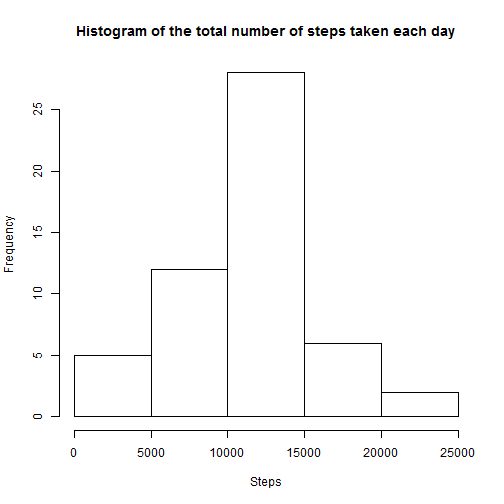

Peer-graded Assignment: Course Project 1
=========================================

This assignment makes use of data from a personal activity monitoring device. This device collects data at 5 minute intervals through out the day. The data consists of two months of data from an anonymous individual collected during the months of October and November, 2012 and include the number of steps taken in 5 minute intervals each day.

## Loading and preprocessing the data
1. Load the data (i.e. read.csv())
2. Process/transform the data


```r
data <- read.csv('activity.csv', stringsAsFactors = F)
data$date <- as.Date(data$date)
cdata <- data[complete.cases(data),]
```

## What is mean total number of steps taken per day?
1. Calculate the total number of steps taken per day.
2. Make a histogram of the total number of steps taken each day.
3. Calculate Mean and Median.


```r
dailysteps <- aggregate(. ~ date, data = cdata, FUN = sum)
hist(dailysteps$steps, xlab = "Steps", main = "Histogram of the total number of steps taken each day")
```



```r
stepmean <- mean(dailysteps$steps)
stepmedian <- median(dailysteps$steps)
```

- Mean: 10766
- Median: 10765

## What is the average daily activity pattern?
1. Make a time series plot of the 5-minute interval (x-axis) and the average number of steps taken, averaged across all days (y-axis).
2. Which 5-minute interval, on average across all the days in the dataset, contains the maximum number of steps?


```r
avgsteps <- aggregate(steps ~ interval, data = cdata, FUN = mean)
plot(avgsteps$interval, avgsteps$steps, type = "l", xlab = "Interval", ylab = "Number of steps", main= "5-minute interval averaged steps across all days")
```


```r
avgsteps[avgsteps$steps == max(avgsteps$steps),]
```

```
##     interval    steps
## 104      835 206.1698
```

## Imputing missing data
*Note that there are a number of days/intervals where there are missing values (coded as NA). The presence of missing days may introduce bias into some calculations or summaries of the data.*

1. The total number of missing values in the dataset.
2. We will fill in all of the missing values in the dataset by using the mean for that 5-minute interval.
3. Create a new dataset that is equal to the original dataset but with the missing data filled in.
4. Make a histogram of the total number of steps taken each day and Calculate and report the mean and median total number of steps taken per day


```r
nrow(data[!complete.cases(data),])
```

```
## [1] 2304
```

```r
avgsteps <- aggregate(steps ~ interval, data = cdata, FUN = mean)

n <- nrow(data)
newdata <- data[1:n,]
newdata$steps <- sapply(seq(n), function (i) {
    interval <- newdata[i,]$interval
    ret <- newdata[i,]$step
    if (is.na(ret)) ret <- round(avgsteps[avgsteps$interval == interval,]$steps)
    ret
})
newdailysteps <- aggregate(. ~ date, data = newdata, FUN = sum)
hist(newdailysteps$steps, xlab = "Steps", main = "Histogram of the total number of steps taken each day")
```


```r
newstepmean <- mean(newdailysteps$steps)
newstepmedian <- median(newdailysteps$steps)
```

- Mean: 10766
- Median: 10762

## Are there differences in activity patterns between weekdays and weekends?
1. Create a new factor variable in the dataset with two levels – “weekday” and “weekend” indicating whether a given date is a weekday or weekend day.
2. Make a panel plot containing a time series plot (i.e. type = "l") of the 5-minute interval (x-axis) and the average number of steps taken, averaged across all weekday days or weekend days (y-axis).


```r
library(lattice)
library(dplyr)

data$dateType <- factor(sapply(data$date, function (d) ifelse(weekdays(d) %in% c("Saturday", "Sunday"), "weekend", "weekday")))

avgsteps <- data %>% 
    filter(complete.cases(.)) %>%
    select(steps, dateType, interval) %>%
    group_by(dateType, interval) %>%
    summarise(steps = mean(steps))

xyplot(steps ~ interval | dateType, data = avgsteps, type="l", layout = c(1, 2))
```


